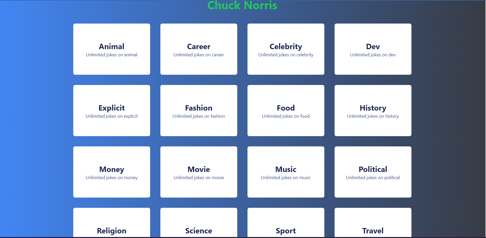

<h1 align="center">
 Joke Generator<br/>
  <a href="https://athlmohn.github.io/chucknorris/" target="_blank">joke gnerator</a>
</h1>
<div align="center">
  
</div>

<br/>

<div>
<p>The Joke Generator App is a simple web application that allows users to generate Chuck Norris jokes from various categories. Users can select a category, and the app will fetch a random joke related to that category from the Chuck Norris API.</p>
</div>


<br/>

## Technologies Used

The Joke Generator App is a simple web application built using the following technologies:

- React: Frontend framework for building the user interface.
- Redux Toolkit: State management library to manage the app's global state.
- Axios: HTTP client for making API requests to the Chuck Norris API.
- Tailwind CSS: CSS framework for styling the user interface.
- React Icons: Library for using icons in the application.
- Eslint & Prettier: For code formatting and linting.


## Specifications

The Joke Generator App provides the following functionalities:

- Display a welcome message with the app title "Chuck Norris."
- Fetch a list of joke categories from the Chuck Norris API.
- Display the list of categories as buttons on the home screen.
- When a user clicks on a category button, the app fetches a random joke from that category and displays it in a JokeDisplay component.
- The JokeDisplay component allows users to see the selected joke, navigate to the next joke, and close the joke display.
- The app shows a loader while fetching the joke to provide a better user experience.
- The app is responsive and works on different screen sizes, adjusting the layout accordingly.

## How to Run the App Locally

Follow the steps below to run the Joke Generator App on your local machine:

1. Clone the repository to your local machine:

```bash
git clone https://github.com/your-username/joke-generator-app.git
